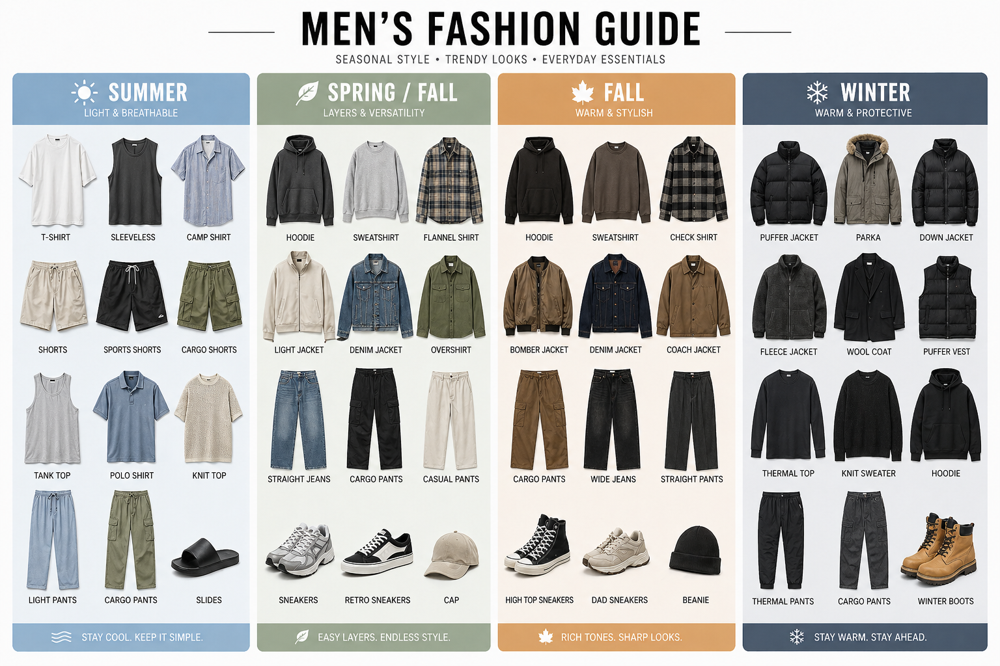

# ️ Kakobuy Spreadsheets 2026 Mens Summer Streetwear Guide: CleanFit & CityBoy Aesthetics

[← Back to Home](/) · [Browse Guides](/posts/)

When it comes to mens summer fashion, the ultimate goal is balancing comfort with a sharp silhouette. You don't need complicated layers to stand out—just the right cuts, proportions, and high-quality essential pieces.

Here are the top two aesthetics dominating streetwear this season and the exact items you need to pull them off.

## 1. Trend #1: The CleanFit Minimalist Look

CleanFit is all about perfectly fitting basics, muted color palettes, and premium textures.

- **The Formula:** A crisp boxy-fit tee paired with tailored straight-leg trousers or clean canvas shorts.
- **Why it works:** It looks effortlessly expensive and sharp without trying too hard.
- **Key Pieces:** 260g heavyweight tees, tailored shorts, minimalist sandals or clean sneakers.

## 2. Trend #2: The CityBoy Oversized Vibe

Rooted in Japanese street culture, the CityBoy style leans heavily into relaxed, voluminous shapes.

- **The Formula:** An oversized heavyweight drop-shoulder t-shirt, baggy cargo utility shorts, crew socks, and retro sneakers.
- **Why it works:** It creates an incredible streetwear silhouette while keeping you completely cool and comfortable.
- **Key Pieces:** Drop-shoulder tees, wide-leg cargo shorts, thick crew socks, vintage-inspired sneakers.

## 3. Trend #3: The Resort Casual Approach

For those summer days when you want to look polished but still feel the breeze.

- **The Formula:** A lightweight linen button-up shirt worn open over a fitted tank top, paired with tailored swim shorts and leather slides.
- **Why it works:** It bridges the gap between beach-ready and street-ready, perfect for summer outings and vacations.
- **Key Pieces:** Linen shirts, fitted tanks, tailored shorts, leather slides.

## 🔥 Featured Summer Wardrobe Essentials

<button onclick="window.open('https://docs.google.com/spreadsheets/d/1Vs190yOAkrQ04LQb6l_Lnr_oTA0ny4CI3PJ_0B4_6zs/edit?gid=1903531254#gid=1903531254', '_blank')" style="cursor:pointer; background:none; border:none; padding:0; width:100%;">

  

    <h4 style="margin: 12px 0 4px 0; color: #fff;">260g Heavyweight Retro Tee</h4>
    
Must-Have Basic

  

  

    <h4 style="margin: 12px 0 4px 0; color: #fff;">Lightweight Utility Cargo Shorts</h4>
    
Trending Item

  

  

    <h4 style="margin: 12px 0 4px 0; color: #fff;">Linen Button-Up Shirt</h4>
    
Resort Essential

  

</button>

## 📐 Summer Outfit Formulas at a Glance

| Occasion       | Top                   | Bottoms           | Footwear        | Accessories   |
| -------------- | --------------------- | ----------------- | --------------- | ------------- |
| Street Casual  | Heavyweight Boxy Tee  | Cargo Shorts      | Retro Sneakers  | Cap + Chain   |
| CleanFit Daily | Fitted Polo Tee       | Tailored Shorts   | Clean Sneakers  | Minimal Watch |
| Beach/Resort   | Linen Shirt + Tank    | Swim Shorts       | Leather Slides  | Sunglasses    |
| Night Out      | Oversized Graphic Tee | Wide-Leg Trousers | Chunky Sneakers | Crossbody Bag |

::: tip 🛍️ HOW TO COP THESE ITEMS WITH EXCLUSIVE DISCOUNTS
All items featured in our style guides are curated directly from top high-street manufacturers and are available for global shipping via our **Discord Community**.

---

### 💬 Join Our Discord Community

Get exclusive access to:
- **Product Recommendations** — Personalized outfit suggestions and trending picks from our fashion curators
- **After-Sales Support** — Dedicated customer service for order tracking, returns, and exchanges
- **Member-Only Deals** — Early access to seasonal sales and exclusive discount codes
- **Style Consultation** — Real-time advice from our styling team to help you build the perfect wardrobe

👉 **[Join Kakobuy Discord](https://discord.com/invite/jtc399kUQV)** to connect with our community and elevate your style game!
:::

***

### 🌐 Explore Other Seasonal Lookbooks

- 🌸 **[Spring Guide:](/posts/spring-style)** [Light Layering & CleanFit Jackets](/posts/spring-style)
- 🍁 **[Autumn Guide:](/posts/autumn-style)** [Earth Tones & Heavyweight Workwear](/posts/autumn-style)
- ❄️ **[Winter Guide:](/posts/winter-style)** [Gorpcore Techwear & Premium Puffers](/posts/winter-style)

